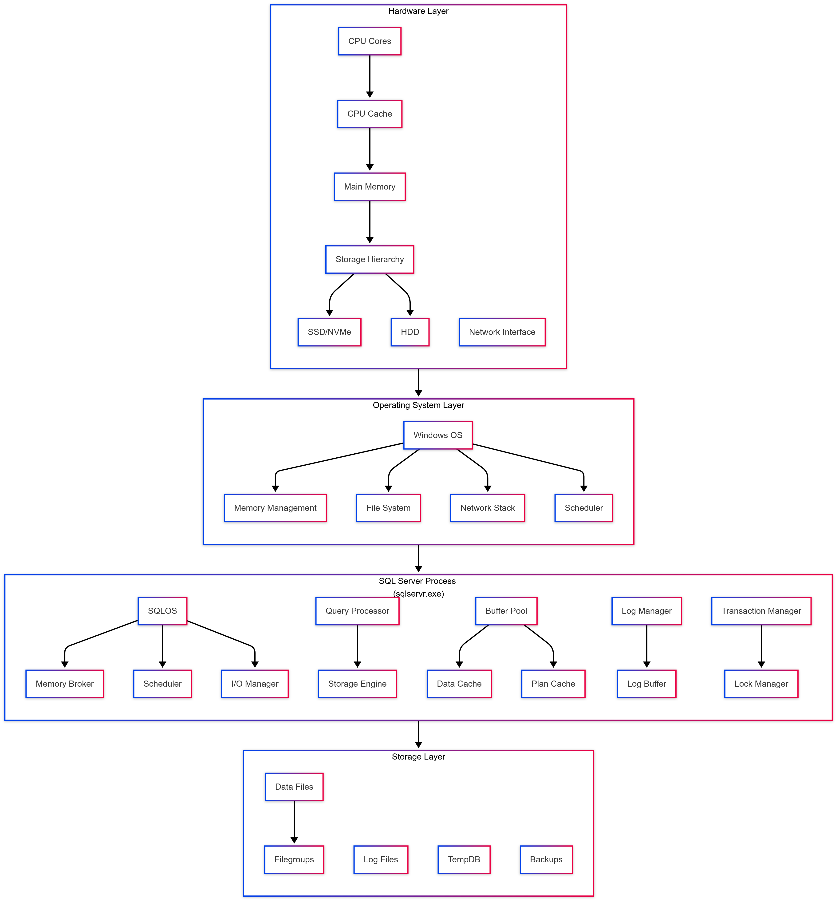
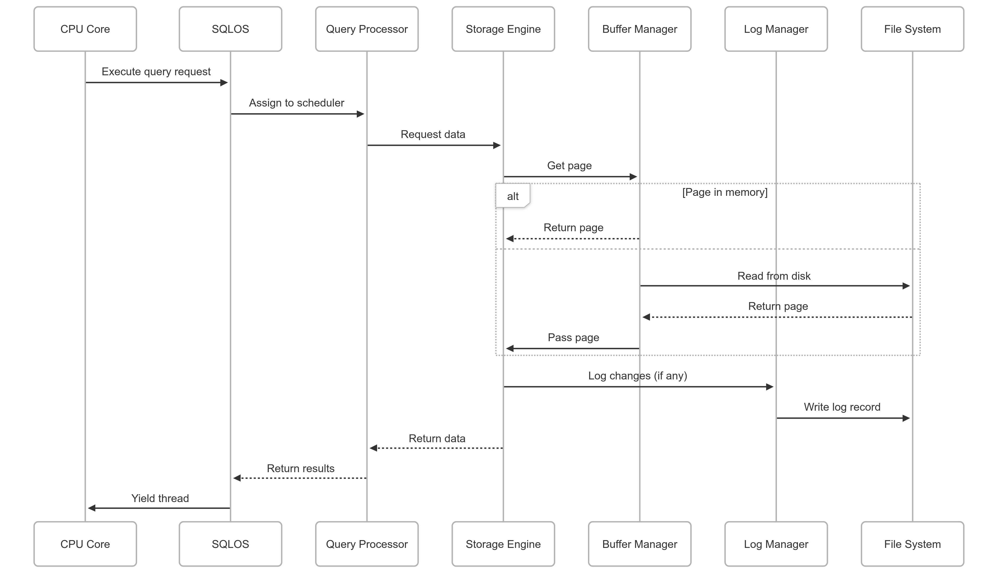

# SQL Server Computer Architecture: A Creator's Perspective

## 1. Foundational Computer Architecture

### Hardware Layer
- CPU Cores → CPU Cache → Main Memory
- Storage Hierarchy (SSD/NVMe → HDD)
- Network Interface

### Operating System Layer
- Windows OS components:
  - Memory Management
  - File System
  - Network Stack
  - Scheduler

### SQL Server Process (sqlservr.exe)
- SQLOS (SQL Operating System) with:
  - Memory Broker
  - Scheduler
  - I/O Manager
- Query Processor → Storage Engine
- Buffer Pool → Data Cache + Plan Cache
- Log Manager → Log Buffer
- Transaction Manager → Lock Manager

### Storage Layer
- Data Files → Filegroups
- Log Files
- TempDB
- Backups

## 2. Key Architectural Decisions

### A. Hardware Utilization
1. **CPU**:
   - NUMA-aware scheduling
   - Worker threads mapped to CPU cores

2. **Memory**:
   - Buffer Pool as main memory cache
   - Lock pages in memory privilege

3. **Storage**:
   - Sequential I/O for transaction logs
   - Random I/O for data files

### B. Process Architecture
1. **SQLOS**:
   - Custom user-mode scheduler
   - Memory management abstraction

2. **Memory Hierarchy**:
   CPU Registers → L1 Cache → L2 Cache → L3 Cache → Buffer Pool → Data Files

3. **I/O Subsystem**:
   - Write-ahead logging (WAL)
   - Checkpoint process

## 3. Component Communication Flow

1. CPU executes query request via SQLOS
2. Query Processor assigns to scheduler
3. Storage Engine requests data
4. Buffer Manager checks memory or disk
5. Log Manager records changes (if any)
6. Results returned up the stack

## 4. Critical Path Optimization

1. **Memory Access Path**:
   CPU → L1 Cache → L2 Cache → L3 Cache → Buffer Pool → Disk

2. **Query Processing Path**:
   Network → Protocol Layer → Parser → Optimizer → Executor → Storage Engine

3. **Transaction Path**:
   Application → Log Buffer → Log File → Data File (async)

## 5. Physical Resource Mapping Example

For a server with:
- 16 CPU cores
- 128GB RAM
- 2TB NVMe storage

**Resource Allocation**:
- Buffer Pool: 96GB (75%)
- Query Processing: 16GB (1GB/core)
- Logging: 8GB
- System Overhead: 8GB

## 6. Why This Architecture?

1. **CPU**: Minimize context switching
2. **Memory**: Maximize cache hits
3. **Disk**: Optimized write patterns
4. **Network**: Efficient protocol

Ensures:
- High throughput for OLTP
- Low latency queries
- Linear scalability