# AWS

## Region

## Organization

## Security
### Overview

### Access Control
#### User
#### User Group
#### Policy
##### Policy element
#### Organization
#### Attributes and tagging

### Access Delegation 
#### Interacting with AWS STS
#### Managing Role Sessionss
#### Sessions Tagging

### Identity Federation 
#### SAML-based Federation
#### Web-based Federation
#### AWS IAM Identity Center for User Federation

### Access analysis and troubleshooting
#### IAM Policy Simulator
#### IAM Access Analyzer
#### Viewing Access History
#### AWS CloudTrail

## Compute
### Computing server
### Serverless
### Container
#### ECS
#### EKS
#### Fargate

## Storage
### Overview
Why organizations move to the cloud?
- Increase organizational agility
- Accelerate ability to innovate
- Strengthene security
- Reduce costs
- Operational exprense versus capital investment

Comparison of storage use: what you pay for?
- Raw capacity
- Formatted capacity
- Allocated capacity
- Actual data capacity

### Core storage services
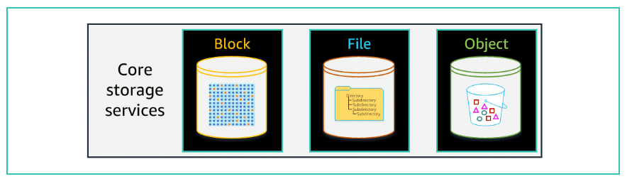
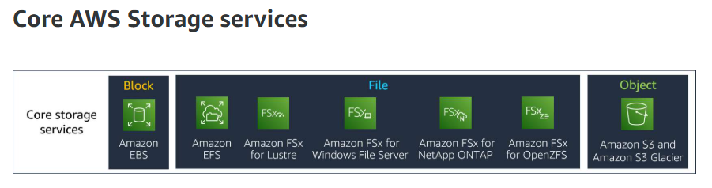
#### Object - S3
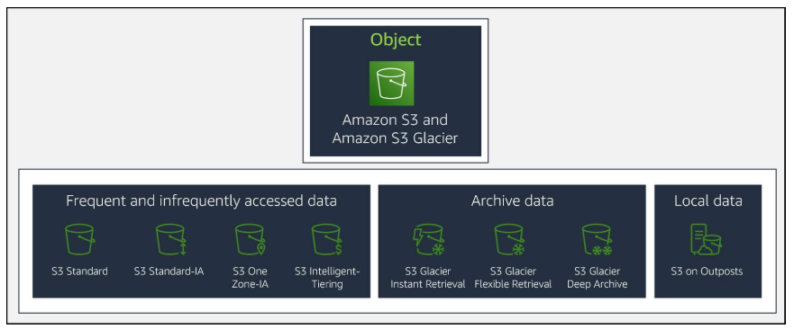
##### Lifecycle service
#### File
##### Amazon EFS
##### Amazon FSx for Lustre
##### Amazon FSx Window File Server
##### Amazon FSx for NetApp ONTAP
##### Amazon FSx for OpenZFS
#### Block
##### Amazon EBS

### Edge and hybrid cloud storage services
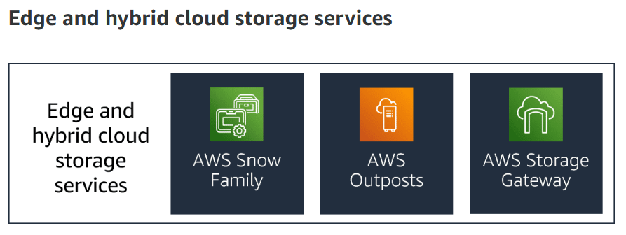
#### AWS Snow Family
#### AWS Outsposts
#### AWS Storage Gateway

### Data transfer and migration services
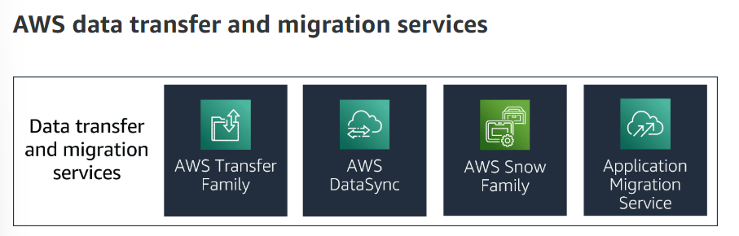

#### AWS Transfer Family
#### AWS DataSync
#### AWS Snow Family
#### Application Migration Service

### Data protection service
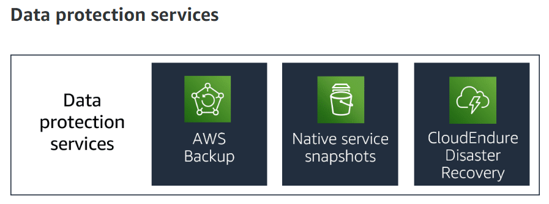
#### AWS Backup
#### Native service snapshots
#### CloudEndure Disaster Recovery

Overall Data storage
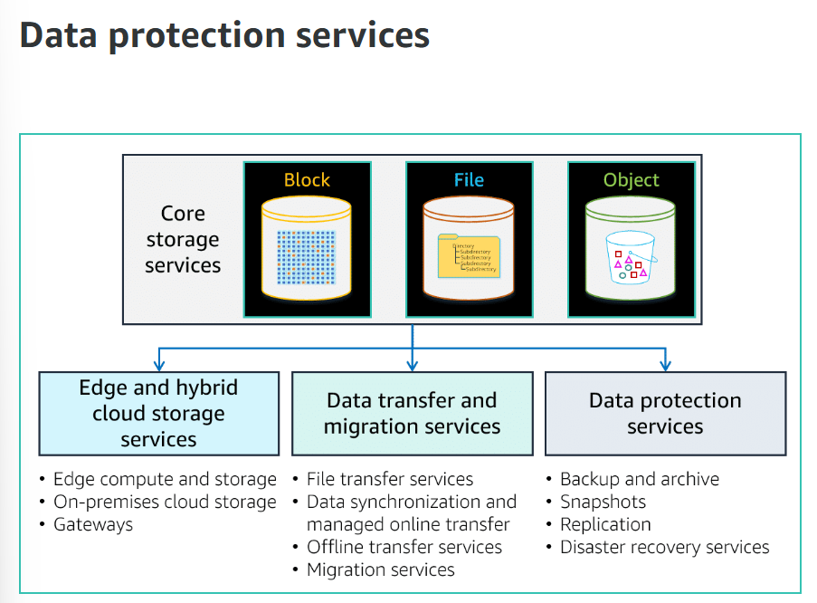

## Networking
### Network foundations
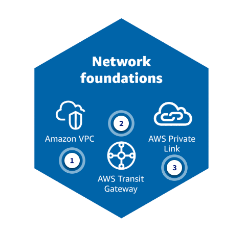

### Hybrid connectivity
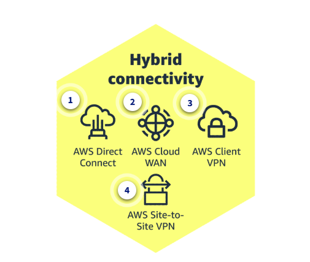

### Edge networking
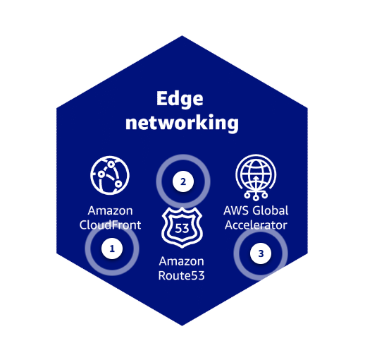

### Application networking
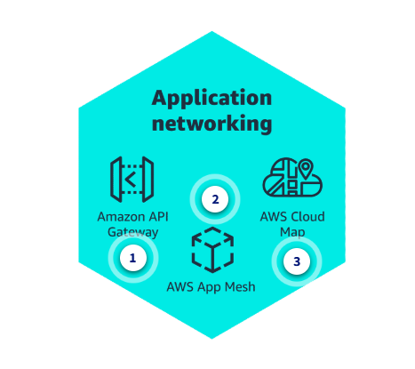

### Network security
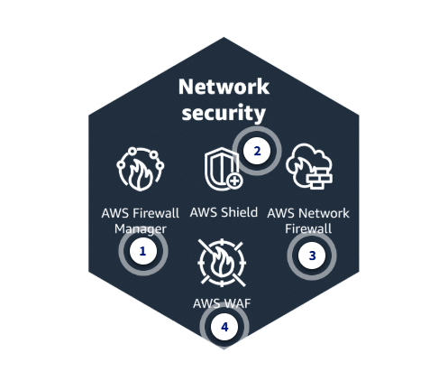

### Networking concepts
#### CIDR - Classless inter-domain routing  
#### Subnet
#### Routing table
#### Internet gateway
#### VPC
#### ELB
#### ACL - Access control list
#### Security group
#### OSI model
#### TCP/IP model

## Database
### Overview
What nature data source types?
- Structured: table
- Semistructed: xml, json
- UnStructed: video, mp3

#### Relational databases
#### Non-relational key-value
#### Non-relations document
#### Non-relations in-memmory
#### Non-relational graph
#### Non-relational graph
#### Non-relational timeseries
#### Non-relational ledger

### RDMS
#### Aurora
#### RDMS db - Postgresql - MySql
### NoSql
#### Dynamodb
#### Document db

## AI