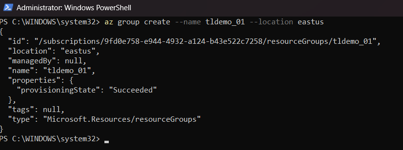
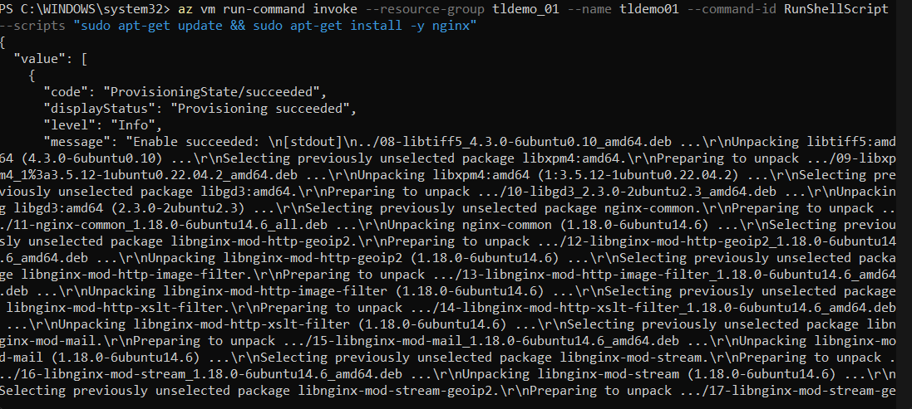
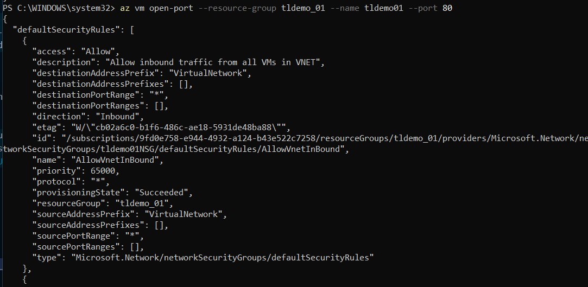
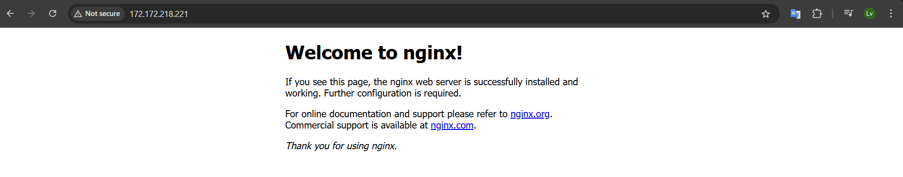
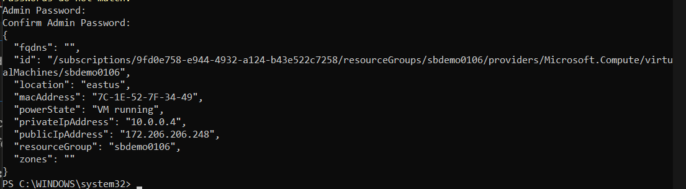
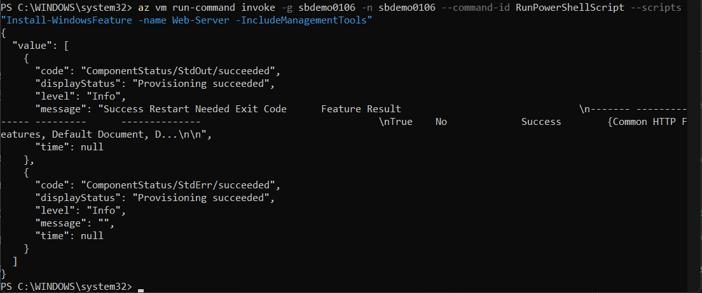
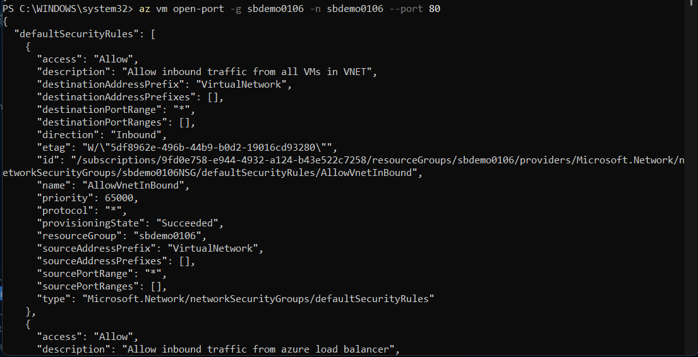

# 1. Develop Azure compute solutions

In this track of the az-204: Developing Solutions for Microsoft Azure journey, the focus will be on the following:

- Implement containerized solutions
- Implement Azure App Service Web Apps
- Implement Azure Functions

## 1.1 Virtual machines

### Discover the key concepts covered in this course

- Create and manage Azure VMs using a variety of tools and techniques, including the Azure CLI, Azure Portal, and Azure PowerShell

- Learn about the basics of Azure VMs and how to create and configure both Linux and Windows VMs in Azure.

- Discuss how to connect to your VMs using various methods, including SSH and Secure Shell(SSH) on Linux VMs and Remote Desktop Protocol(RDP) on Windows VMs.

- Cover how to use SSH public-private key pairs

### Outline the use of virtual machines (VMs) in Azure

- Virtualization/emulation of a physical computer system. E.g a digital version of a physical computer

- Runs on an isolated partition of its host computer with its own CPU, memory, network interface, and storage.

- Ideal when seeking more control over the computing environment

- Enables virtualization without having to purchase or maintain the physical hardware used to operate virtual machines

- Configuring, Patching, Installing

**Use cases**

- Development & testing
- Applications
- Datacenter

**Considerations**

- Resource locations
- Virtual machine sizes
- Maximum number of virtual machines
- Virtual machine configuration(s)

**Locations to create or access resources**

- Azure portal
- Azure PowerShell
- Azure CLI
- REST API

**Availability**

- Availability zones
- Virtual machine scale sets

**Pricing Factors**

- Processing power: the more cpu, thee more the cost.
- Memory: the same processing power
- Storage capacity: larger is more expensive
- Network bandwidth

**Core Limitations**

- The main quota is that you can have a maximum of 20 VMs per subscription

**Managed data disks**

- CLI, PowerShell

### Create a Linux VM with Azure CLI

Azure Linux VM Demo Summary
This guide summarizes the key steps and takeaways from a demo on creating a Linux VM using Azure CLI, installing an Nginx web server, and verifying its functionality by accessing it via a browser.
Key Takeaways
Prerequisites

Active Azure subscription with appropriate permissions.
Latest Azure CLI installed (Azure CLI Installation).
PowerShell or terminal for running Azure CLI commands.
SSH client for VM access.

Step-by-Step Process

Log in to Azure CLI:

Command: `az login`
Action: Authenticate via browser to connect CLI to your Azure account.
Note: Ensure you're logged in for all CLI operations.

Create a Resource Group:

Command: `az group create --name sbdemo0103 --location eastus`
Purpose: Create a logical container (sbdemo0103) in the eastus region for Azure resources.
Tip: Choose a region close to your location.



Create a Linux VM:

Command:

```
az vm create \
 --resource-group sbdemo0103 \
 --name sbdemo0103 \
 --image debian \
 --admin-username azureuser \
 --generate-ssh-keys \
 --public-ip-sku Standard
 --size Standard_B1s
 --location eastus
```

Details:
Creates a Debian-based VM named sbdemo0103 in the sbdemo0103 resource group.
Uses azureuser as the admin username.
Generates SSH keys for secure access.
Assigns a standard public IP address.

Output: Save the public IP address (e.g., 20.124.50.242) for later use.

Install Nginx Web Server:

Command:

```
az vm run-command invoke \
 --resource-group sbdemo0103 \
 --name sbdemo0103 \
 --command-id RunShellScript \
 --scripts "sudo apt-get update && sudo apt-get install -y nginx"
```

Purpose: Runs a shell script on the VM to update packages and install Nginx.


Open Port 80:

Command: `az vm open-port --resource-group sbdemo0103 --name sbdemo0103 --port 80`
Purpose: Allows HTTP traffic to the VM to access the Nginx web server.

Verify Web Server:

Action: Open a browser and navigate to the VM’s public IP (e.g., http://20.124.50.242).
Expected Result: Displays the "Welcome to nginx!" page, confirming the VM and web server are operational.



Clean Up Resources:

Command: `az group delete --name sbdemo0103 --no-wait --yes --verbose`
Purpose: Deletes the resource group and all associated resources (VM, public IP, etc.) to avoid costs.
Note: Deletion may take a few minutes.

Additional Notes

Resource Group: Acts as a logical folder for organizing Azure resources.
SSH Keys: Automatically generated during VM creation for secure Linux VM access.
Public IP: Essential for external access to the VM (e.g., via SSH or browser).
Cost Management: Always delete unused resources to prevent unnecessary charges.

Quick Reference

Login: az login
Resource Group: `az group create --name <name> --location <region>`

Create VM: `az vm create --resource-group <name> --name <vm-name> --image debian --admin-username <username> --generate-ssh-keys --public-ip-sku Standard`

Install Software: `az vm run-command invoke --resource-group <name> --name <vm-name> --command-id RunShellScript --scripts "<linux-commands>"`

Open Port: `az vm open-port --resource-group <name> --name <vm-name> --port 80`

Delete Resources: `az group delete --name <name> --no-wait --yes --verbose`

For detailed documentation, refer to Azure Virtual Machines.

### Create a Linux VM with Azure portal

### Create a Linux VM with Azure PowerShell

#### Prerequisites

- Latest version of Azure PowerShell installed
- Azure account with appropriate permissions

#### Step-by-Step Process

##### 1. Connect to Azure

```powershell
Connect-AzAccount
```

- Opens browser for authentication
- Sign in with your Azure credentials
- Close browser and return to PowerShell

##### 2. Create Resource Group

```powershell
New-AzResourceGroup -Name sbdemo0105 -Location EastUS
```

**Key Points:**

- Resource group = logical container for resources
- Use capitalization for all Azure PowerShell commands
- Choose location close to your region

##### 3. Create Linux VM

```powershell
New-AzVm -ResourceGroupName sbdemo0105 -Name sbdemo0105 -Location EastUS -Image Debian -Size Standard_B2s -PublicIPAddressName sbdemo0105 -OpenPorts 80 -GenerateSshKey -SshKeyName sbdemo0105
```

**Command Breakdown:**

- `-ResourceGroupName`: Specify the resource group
- `-Name`: VM name
- `-Location`: Azure region
- `-Image`: OS image (Debian in this case)
- `-Size`: VM size (Standard_B2s)
- `-PublicIPAddressName`: Public IP resource name
- `-OpenPorts 80`: Open port 80 for web traffic
- `-GenerateSshKey`: Generate SSH keys automatically
- `-SshKeyName`: Name for the SSH key

**During Creation:**

- Prompts for username and password
- Generates private and public SSH keys
- Process takes several minutes

##### 4. Install Web Server on VM

```powershell
# Create bash script
echo 'sudo apt-get update && sudo apt-get install -y nginx' > sbdemo0105.sh

# Execute script on VM
Invoke-AzVMRunCommand -ResourceGroup sbdemo0105 -Name sbdemo0105 -CommandId RunShellScript -ScriptPath \sbdemo0105.sh
```

**Key Points:**

- Can't execute commands directly on VM
- Must create a script file first
- Script installs Nginx web server

##### 5. Get VM Public IP Address

```powershell
Get-AzPublicIPAddress -ResourceGroupName sbdemo0105 -Name sbdemo0105 | select "IPAddress"
```

- Retrieves the public IP address of the VM
- Use this IP to access the web server

##### 6. Test the Web Server

- Copy the IP address from PowerShell output
- Navigate to the IP address in your browser
- Should see "Welcome to nginx!" page

##### 7. Clean Up Resources

```powershell
Remove-AzResourceGroup -Name sbdemo0105
```

- Deletes the entire resource group and all resources within it
- Confirm deletion when prompted

#### Important Notes

##### Azure PowerShell Syntax Rules

- All Azure PowerShell commands use capitalization
- Resource groups are logical containers for resources
- Most everything in Azure is a resource

##### VM Creation Process

- VM creation takes several minutes
- SSH keys are automatically generated
- Public IP is created as a separate resource

##### Security Considerations

- Port 80 opened for web traffic
- SSH keys generated for secure access
- Username and password required during creation

##### Best Practices

- Always clean up resources after testing to avoid charges
- Choose appropriate VM sizes for your needs
- Select regions close to your location for better performance

#### Quick Reference Commands

```powershell
# Connect to Azure
Connect-AzAccount

# Create resource group
New-AzResourceGroup -Name <name> -Location <location>

# Create VM
New-AzVm -ResourceGroupName <rg-name> -Name <vm-name> -Location <location> -Image <image> -Size <size> -PublicIPAddressName <ip-name> -OpenPorts <port> -GenerateSshKey -SshKeyName <key-name>

# Run command on VM
Invoke-AzVMRunCommand -ResourceGroup <rg-name> -Name <vm-name> -CommandId RunShellScript -ScriptPath <script-path>

# Get public IP
Get-AzPublicIPAddress -ResourceGroupName <rg-name> -Name <ip-name> | select "IPAddress"

# Clean up
Remove-AzResourceGroup -Name <rg-name>
```

### Create a Window VM with Azure CLI

#### Prerequisites

- Azure CLI installed and configured
- Azure account with appropriate permissions
- PowerShell or command prompt access

#### Step-by-Step Process

##### 1. Create Resource Group

```bash
az group create -n sbdemo0106 --location eastus
```

**Key Points:**

- Resource group = logical container for resources
- `-n`: Name parameter (short form)
- `--location`: Azure region for deployment
- Choose location close to your region for better performance

##### 2. Create Windows VM

```bash
az vm create -g sbdemo0106 -n sbdemo0106 --image Win2019Datacenter --admin-username azureuser --public-ip-sku Standard --size Standard_B1s
```

**Command Breakdown:**

- `-g`: Resource group name (short form of `--resource-group`)
- `-n`: VM name (short form of `--name`)
- `--image`: OS image (Win2019Datacenter)
- `--admin-username`: Administrator account name
- `--public-ip-sku`: Public IP type (Standard)
- `--size Standard_B1s`: Size of VM

**During Creation:**

- Prompts for administrator password: SuperPa$$w0rd
- Confirm password
- Process takes several minutes
- **Important**: Save the public IP address from output



##### 3. Install Web Server on VM

```bash
az vm run-command invoke -g sbdemo0106 -n sbdemo0106 --command-id RunPowerShellScript --scripts "Install-WindowsFeature -name Web-Server -IncludeManagementTools"
```

**Key Points:**

- Uses `vm run-command invoke` to execute commands remotely
- `--command-id RunPowerShellScript`: Specifies PowerShell execution
- `Install-WindowsFeature`: Windows PowerShell command to install IIS
- `-name Web-Server`: Installs Internet Information Services (IIS)
- `-IncludeManagementTools`: Includes management tools for IIS



##### 4. Open Port 80 for Web Traffic

```bash
az vm open-port -g sbdemo0106 -n sbdemo0106 --port 80
```

**Important:**

- Port 80 must be opened for HTTP web traffic
- This modifies the Network Security Group (NSG) rules
- Without this step, web server won't be accessible from internet



##### 5. Test the Web Server

- Use the public IP address from step 2 output
- Navigate to the IP address in your browser
- Should see "Internet Information Services" default page
- Confirms VM is working and web server is accessible

##### 6. Clean Up Resources

```bash
az group delete -n sbdemo0106
```

- Deletes the entire resource group and all contained resources
- Confirm deletion when prompted (type 'y')
- Prevents ongoing charges for unused resources

#### Important Notes

##### Azure CLI Syntax

- Uses lowercase commands with hyphens
- Short forms available: `-g` for `--resource-group`, `-n` for `--name`
- Parameter values are case-sensitive (e.g., `Win2019Datacenter`, `Standard`)

##### Windows VM Specifics

- Default image: Windows Server 2019 Datacenter
- Uses PowerShell for remote command execution
- IIS (Internet Information Services) as the web server
- Requires password authentication for admin user

##### Network Configuration

- Public IP created automatically
- Port 80 must be explicitly opened for web access
- Network Security Group rules are modified automatically

##### Security Considerations

- Administrator username and password required
- Public IP exposes VM to internet
- Only necessary ports should be opened
- Always clean up test resources

#### Quick Reference Commands

```bash
# Create resource group
az group create -n <resource-group-name> --location <location>

# Create Windows VM
az vm create -g <resource-group> -n <vm-name> --image Win2019Datacenter --admin-username <username> --public-ip-sku Standard

# Install web server
az vm run-command invoke -g <resource-group> -n <vm-name> --command-id RunPowerShellScript --scripts "Install-WindowsFeature -name Web-Server -IncludeManagementTools"

# Open port 80
az vm open-port -g <resource-group> -n <vm-name> --port 80

# Delete resource group
az group delete -n <resource-group-name>
```

#### Comparison with Linux VM Creation

| Aspect          | Windows VM                   | Linux VM                 |
| --------------- | ---------------------------- | ------------------------ |
| Image           | `Win2019Datacenter`          | `Ubuntu2204` or `Debian` |
| Authentication  | Username/Password            | SSH Keys (preferred)     |
| Web Server      | IIS (Install-WindowsFeature) | Nginx/Apache (apt-get)   |
| Remote Commands | RunPowerShellScript          | RunShellScript           |
| Default Ports   | 3389 (RDP), 80 (HTTP)        | 22 (SSH), 80 (HTTP)      |

#### Best Practices

- Always note the public IP address during VM creation
- Test connectivity before installing software
- Open only necessary ports for security
- Use strong passwords for Windows VMs
- Clean up resources immediately after testing
- Consider using parameter files for complex deployments

### Create a Window VM with Azure portal

### Create a Window VM with Azure PowerShell

### Connect to a Linux VM

### Connect to a VM running Windows

### Connect to a VM using Secure Shell(SSH)

### Create and manage SSH keys for a Linux VM

### Generate SSH keys in Azure portal

### Generate SSH keys in Azure CLI

#### Prerequisites

- Azure CLI installed and configured
- Existing Azure VM (Linux-based)
- PowerShell or command prompt access
- Resource group with VM already created

#### Step-by-Step Process

##### 1. Create SSH Key Pair in Azure

```bash
az sshkey create -g sbdemo0110 -n sbdemo0114
```

**Command Breakdown:**

- `az sshkey create`: Creates SSH key pair in Azure
- `-g`: Resource group name (short form)
- `-n`: Name for the SSH key resource

**What Happens:**

- Creates both private and public key
- Saves keys locally in specified folder (usually `.ssh` directory)
- Stores public key in Azure for VM access
- Returns file paths for both keys

##### 2. Get VM Public IP Address

```bash
az network public-ip show -g sbdemo0110 -n sbdemo0110-ip | ConvertFrom-Json | select "ipAddress"
```

**Command Breakdown:**

- `az network public-ip show`: Retrieves public IP information
- `-g`: Resource group name
- `-n`: Public IP resource name (usually `<vm-name>-ip`)
- `| ConvertFrom-Json`: Converts JSON output to PowerShell object
- `| select "ipAddress"`: Extracts only the IP address value

**Important Notes:**

- Public IP resource typically named `<VM-name>-ip`
- JSON conversion needed for PowerShell processing
- Case-sensitive: `"ipAddress"` (lowercase 'i', uppercase 'A')

##### 3. Connect to VM Using SSH Key

```bash
ssh -i .\.ssh\<key-filename>.pub azureuser@<IP-ADDRESS>
```

**Example:**

```bash
ssh -i .\.ssh\1677784226_5817175.pub azureuser@4.154.67.226
```

**Key Points:**

- `-i`: Specifies identity file (private key)
- Path to private key file in `.ssh` directory
- `azureuser`: Default username (or your specified username)
- Use the IP address obtained from step 2

##### 4. Upload Existing SSH Key to Azure

```bash
az sshkey create -g sbdemo0110 -n sbdemo0114-2 --public-key "@.\.ssh\<key-filename>.pub"
```

**Command Breakdown:**

- Same `az sshkey create` command
- `--public-key`: Specifies existing public key file
- `@` symbol: Critical - tells Azure this is a file reference, not the key content
- Must use public key file (.pub extension)

**Important:**

- The `@` symbol is crucial - without it, Azure interprets the path as the actual key content
- Only uploads public key to Azure
- No private key is generated or returned
- Existing private key remains on local system

#### Key Concepts

##### SSH Key Management in Azure

- **Public Key**: Stored in Azure and on local system
- **Private Key**: Only stored on local system (never shared)
- **Key Names**: Can be different from VM names
- **Resource Groups**: Best practice to store keys in same RG as VM

##### File Permissions (Linux Systems)

- Microsoft recommends changing private key permissions on Linux
- Use `chmod` utility to secure private key file
- Not required for Windows systems in this demo

##### Public IP Naming Convention

- Default pattern: `<VM-name>-ip`
- Can be customized during VM creation
- Must match exact name when querying

#### Security Best Practices

##### Key Management

- Delete resource groups after demos to remove keys
- Keep private keys secure and never share
- Use proper file permissions on Linux systems
- Regularly rotate SSH keys for production systems

##### Connection Security

- Always use SSH keys instead of passwords when possible
- Verify IP addresses before connecting
- Use `exit` command to properly close SSH sessions
- Monitor SSH access logs

#### Quick Reference Commands

```bash
# Create new SSH key in Azure
az sshkey create -g <resource-group> -n <key-name>

# Get VM public IP
az network public-ip show -g <resource-group> -n <public-ip-name> | ConvertFrom-Json | select "ipAddress"

# Connect via SSH
ssh -i <path-to-private-key> <username>@<ip-address>

# Upload existing public key
az sshkey create -g <resource-group> -n <key-name> --public-key "@<path-to-public-key>"

# Exit SSH session
exit
```

#### Troubleshooting Tips

##### Common Issues

- **Permission Denied**: Check private key file permissions
- **Key Not Found**: Verify file path and extension (.pub for public key)
- **Connection Timeout**: Verify IP address and network security group rules
- **Authentication Failed**: Ensure using correct private key file

##### File Path Issues

- Windows: Use `.\` for current directory
- Backslashes in Windows paths: `\.ssh\`
- Forward slashes in Linux paths: `/.ssh/`

##### JSON Conversion Problems

- Ensure `ConvertFrom-Json` is properly capitalized
- Check for proper pipe symbols `|`
- Verify JSON output format from Azure CLI

#### Comparison: Create vs Upload

| Method              | Command                                                     | Use Case           | Output                       |
| ------------------- | ----------------------------------------------------------- | ------------------ | ---------------------------- |
| **Create New**      | `az sshkey create -g <rg> -n <name>`                        | Need new key pair  | Both private and public keys |
| **Upload Existing** | `az sshkey create -g <rg> -n <name> --public-key "@<file>"` | Have existing keys | Confirmation only            |

#### Best Practices Summary

- Store SSH keys in same resource group as VM
- Use descriptive names for key resources
- Always use `@` symbol when referencing key files
- Clean up demo resources to remove keys
- Test connectivity after key creation
- Keep private keys secure and local-only

##### Summarize the key concepts covered in this course

## 1.2 Resource Manager Templates

### Discover the key concepts covered in this course

#### Course Introduction

Azure Resource Manager (ARM) templates are essential tools for managing Azure resources in a consistent and automated manner. This course provides comprehensive training on creating and deploying ARM templates using various tools and methodologies.

#### Learning Objectives

##### Core Concepts

- Understanding ARM template fundamentals
- Working with JSON template structure
- Template specification requirements

##### Tools and Techniques

- **Visual Studio Code** - Primary development environment
- **Azure Portal** - Web-based template management
- **Deployment Scripts** - Automation of template deployment processes

##### Key Capabilities Covered

- Creating and deploying templates locally
- Exporting existing templates for reuse
- Template quality assurance and testing
- Automated deployment workflows

#### Course Structure

The course follows a hands-on approach with:

- **Practical exercises** throughout each module
- **Lab assignments** for real-world application
- **Progressive complexity** from basics to advanced concepts

---

#### Summary

This course serves as a comprehensive introduction to ARM templates, covering everything from basic JSON template creation to advanced deployment automation. Students will gain practical experience with industry-standard tools while preparing for the AZ-204 certification exam.

#### Key Points

- ARM templates enable consistent, automated Azure resource management
- Multiple tools available: Visual Studio Code and Azure Portal
- Course includes both theoretical knowledge and hands-on practice
- Directly aligned with AZ-204 certification requirements
- Emphasis on automation and quality assurance practices

#### Important Concepts

- **ARM Templates**: Infrastructure as Code (IaC) for Azure
- **JSON Structure**: Template format and syntax
- **Deployment Scripts**: Automation capabilities
- **Template Export**: Reusability and sharing
- **Local Development**: Offline template creation and testing

#### Questions/Notes

- What specific Azure resources will be covered in the hands-on labs?
- Are there prerequisites for Visual Studio Code setup?
- How does this course integrate with other AZ-204 preparation materials?

### Outline the use of Azure Resource Manager (ARM) templates

#### What are ARM Templates?

ARM templates are **JSON-formatted files** that define the infrastructure and configuration of Azure projects using **declarative syntax**. They serve as Infrastructure as Code (IaC) to specify all Azure resources you want to deploy along with their properties and configurations.

##### Alternative: Bicep

- ARM templates can also be written using **Bicep** (a coding language)
- Bicep templates ultimately compile into JSON format

#### Key Benefits of ARM Templates

##### Repeatability

- **Consistent results** every time the template is executed
- Same outcome regardless of how many times you run the template

##### Orchestration

- Deploy **multiple resources** in a single template
- Define **dependencies** between resources
- Control **deployment order** automatically

##### Extensibility

- Use **deployment scripts** to execute custom PowerShell or Bash scripts
- Enables virtually unlimited customization during deployment

##### Validation & Testing

- **Pre-deployment validation** ensures templates work before actual deployment
- **What-if operations** preview changes without deploying
- Built-in Azure validation checks template correctness

##### Modularity

- Create **modular templates** instead of monolithic files
- Main template can reference **separate module files**
- Modules can be stored in **central repositories**

#### ARM Template Structure

ARM templates contain specific sections:

##### Core Sections

- **Parameters**: Input values required from users when running the template
- **Variables**: Generated values within the template for easier coding
- **Resources**: Main section containing definitions of Azure resources to deploy
- **Outputs**: Values returned after template execution
- **User-defined Functions**: Reusable functions for common operations (e.g., key acquisition)

#### Deployment Methods

##### Available Tools

- **Azure Portal**: Browser-based custom template import and deployment
- **Azure Cloud Shell**: Command-line access within the portal
- **Azure CLI**: Local system command execution (recommended by instructor)
- **Azure PowerShell**: PowerShell-based deployment commands
- **Azure REST API**: Advanced option for direct API calls
- **GitHub Integration**: Deploy-to-Azure buttons in repositories

#### Template Limitations

##### Size and Quantity Constraints

- Maximum template size: **4 megabytes**
- Maximum parameters: **256**
- Maximum variables: **256**
- Maximum resources: **800**
- Maximum unique locations: **10** (best practice: deploy to same region)

#### Development Tools

##### Visual Studio Code (Primary Tool)

- **ARM template language support**
- **Bicep plugin** integration
- **Community resource snippets**
- **Auto-completion** features
- Enhanced productivity for template creation

##### ARM Template Test Toolkit

- **Microsoft-provided script** for validation
- Checks **best practices compliance**
- **Error detection** before deployment
- **Suggestion engine** for improvements and updates

#### Use Cases

##### Enterprise Applications

- **Policy as Code**: Centralized policy management through version control
- **CI/CD Integration**: Seamless deployment pipeline integration
- **Blueprint Templates**: Pre-built templates for common scenarios
- **Resource Export**: Generate templates from existing deployments

---

#### Summary

ARM templates are the **de facto standard** for Azure resource management, providing a declarative approach to infrastructure deployment. They enable consistent, repeatable, and automated resource provisioning while supporting complex orchestration and validation workflows.

#### Key Points

- ARM templates use JSON declarative syntax for infrastructure definition
- Provide repeatable, consistent deployment results across environments
- Support complex orchestration with resource dependencies
- Include built-in validation and testing capabilities
- Integrate seamlessly with modern DevOps practices and CI/CD pipelines
- Visual Studio Code is the recommended development environment

#### Important Concepts

- **Declarative Syntax**: Describe desired state rather than deployment steps
- **Infrastructure as Code**: Version-controlled, testable infrastructure definitions
- **Template Modularity**: Reusable components and centralized repositories
- **What-if Operations**: Safe preview of deployment changes
- **Resource Orchestration**: Automated dependency management and deployment ordering

#### Questions/Notes

- How do ARM templates compare to other IaC tools like Terraform?
- What are the performance implications of template size limits?
- Best practices for organizing complex multi-resource deployments?
- Integration patterns with existing CI/CD pipelines?

### Install and set up Visual Studio

#### 1. ✅ Download & Install VS Code

- Open browser → Search: `Download Visual Studio Code`
- Go to: [https://code.visualstudio.com/download](https://code.visualstudio.com/download)
- Download the **User Installer x64** (for Windows)
- Follow Setup Wizard:
  - Accept license agreement
  - Use default install location
  - Add **"Open with Code"** to Windows Explorer context menu
  - Click **Install** and then **Finish** to launch VS Code

---

#### 2. 🧭 Explore Visual Studio Code Interface

- **Left Toolbar Icons:**
  - 📁 File Explorer
  - 🔍 Search
  - 🔄 Source Control (e.g., Git)
  - 🐞 Debug
  - 🧩 Extensions
- **Bottom Left:** Profile & Settings
- **Top Menu:** File, Edit, View, Run, etc.

---

#### 3. 💡 ARM Templates & Bicep

- ARM templates are **JSON files** used to define Azure infrastructure
- **Bicep** is a higher-level syntax that compiles into ARM JSON
  - More readable and maintainable
  - Better suited for developers

---

#### 4. ⚙️ Install Bicep Extension

- Click **Extensions** icon (last on left toolbar)
- Search for **Bicep**
- Install the main Bicep extension

---

#### 5. 📂 Create a Project Folder

- Go to: **File → Open Folder**
- Create folders:
  - `C:\work\cldsaz2302`
- Select the folder and click **Select Folder**
- Accept the **"Do you trust this folder?"** prompt

---

#### ✅ Final Setup Summary

- Installed **VS Code**
- Added **Bicep extension**
- Created a **project folder**
- Ready to begin writing and managing **ARM templates**

> You are now fully set up to start your journey with Infrastructure as Code (IaC) on Azure using VS Code and Bicep.

### Create JSON templates with Visual Studio

a demonstration is provided on how to create an Azure Resource Manager (ARM) template using Visual Studio Code (VS Code) with the Bicep language, which is then compiled into a JSON template. The demo focuses on creating a simple ARM template to deploy an Azure storage account, covering key components like variables, parameters, resources, tags, and outputs. It highlights the use of Bicep for easier template creation and the process of compiling it to JSON for comparison. This is part of a course preparing learners for the AZ-204: Developing Solutions for Microsoft Azure certification exam.

#### Key Steps and Concepts:

- **Setup**:

  - Open VS Code and access a project folder (e.g., `CLDSAZ2302`) created previously with the Bicep plug-in installed.
  - Create a new Bicep file named `azuredeploy.bicep` in the project folder via the Explorer panel.

- **Creating the ARM Template in Bicep**:

  - **Variable**: Define a variable `storageAccountName` with the value `'sbdemo0204'`. VS Code flags unused variables (underlined) to ensure proper usage.
  - **Resource Definition**:
    - Define a storage account resource named `storageAccount` using the `Microsoft.Storage/storageAccounts` resource type (version 2022-09-01).
    - Set properties:
      - `name`: Reference the `storageAccountName` variable.
      - `location`: Initially hardcoded as `'EastUS'`, later replaced with a parameter.
      - `sku`: Set to `Standard_LRS` (Locally Redundant Storage).
      - `kind`: Set to `StorageV2`.
  - **Parameter**:
    - Add a `location` parameter with a default value tied to the resource group’s location (`resourceGroup().location`) to avoid hardcoding, resolving the underlined location error.
    - Replace the hardcoded `'EastUS'` with the `location` parameter.
  - **Tags**:
    - Add tags for better resource management and billing queries:
      - `environment: 'dev'`
      - `business_unit: 'connectivity'`
  - **Output**:
    - Define an output `accountName` to return the `storageAccountName` value after deployment.
  - Save the file (`Ctrl+S`).

- **Compiling Bicep to JSON**:

  - Compile the Bicep file to JSON using `Ctrl+Shift+B` or by right-clicking the file and selecting "Build ARM Template."
  - This generates a new file, `azuredeploy.json`, in the Explorer panel.
  - The JSON file includes:
    - Metadata about the file.
    - Parameters section with the `location` parameter.
    - Variables section with `storageAccountName`.
    - Resources section defining the storage account.
    - Outputs section with the `accountName` output.

- **Key Features Highlighted**:

  - **Bicep Advantages**: Bicep simplifies ARM template creation with a more readable syntax and features like autocomplete in VS Code, making complex templates easier to manage.
  - **VS Code Support**: The Bicep plug-in provides autocomplete, error detection (e.g., unused variables, hardcoded locations), and compilation to JSON.
  - **JSON Comparison**: The compiled JSON closely mirrors the Bicep file but is more verbose, reinforcing Bicep’s ease of use for complex templates.

- **Code Example** (Bicep):
  ```bicep
  param location string = resourceGroup().location
  var storageAccountName = 'sbdemo0204'
  resource storageAccount 'Microsoft.Storage/storageAccounts@2022-09-01' = {
    name: storageAccountName
    location: location
    sku: {
      name: 'Standard_LRS'
    }
    kind: 'StorageV2'
    tags: {
      environment: 'dev'
      business_unit: 'connectivity'
    }
  }
  output accountName string = storageAccountName
  ```

#### Course Context:

- The demo emphasizes practical ARM template creation using VS Code and Bicep, with hands-on steps to build, validate, and compile templates.
- It prepares learners for the AZ-204 exam by demonstrating real-world Azure resource management techniques.

### Create JSON templates with Azure Portal

**Objective:**  
Use the **Azure Portal** to generate, review, and optionally deploy an **ARM (JSON) template** using built-in quickstart templates.

---

#### 🧰 Tools Used

- Azure Portal (https://portal.azure.com)

---

#### 🪜 Step-by-Step Instructions

##### 1. Access the Custom Template Feature

- Go to Azure Portal
- In the **search bar**, type:  
  `deploy a custom template`
- Click **"Deploy a custom template"** from the results

---

##### 2. Load a Quickstart Template

- On the "Custom deployment" screen:
  - Choose **"Quickstart template"** as the source
  - In the dropdown, search for:  
    `storage-account-create`
  - Select: `microsoft.storage/storage-account-create`
- Click **Edit template**

---

##### 3. Review the Auto-Generated JSON Template

- The editor displays a **JSON ARM template**
- Key elements in the template:

```jsonc
{
  // Metadata at the top
  "parameters": {
    "location": { ... },
    "storageAccountName": { ... },
    ...
  },
  "resources": [
    {
      "type": "Microsoft.Storage/storageAccounts",
      "apiVersion": "2022-09-01",
      "name": "[parameters('storageAccountName')]",
      "location": "[parameters('location')]",
      "sku": { "name": "Standard_LRS" },
      "kind": "StorageV2"
    }
  ],
  "outputs": {
    "storageAccountName": { ... },
    "storageAccountId": { ... }
  }
}
```

### Create and deploy a template spec

#### 1. Create a Template Spec via Azure CLI

##### az login

```
az login

```

##### Create a resource group for Spec

```
az group create -n specrg --location eastus
```

##### Create the template the spec

```
az ts create \
  -g specrg \
  -n storageSpec \
  --version "1.0" \
  --location eastus \
  --template-file .\azuredeploy.json

```

### 3. Deploy resources from the template Spec

#### Create a Deployment Resource Group

```
az group create -n deployrg --location eastus

```

#### Get the Template Spec Id

```
$id = az ts show -g specrg -n storageSpec --version "1.0" --query "id"

echo $id

```

#### Deploy the Template Spec

```
az deployment group create \
  -g deployrg \
  --template-spec $id \
  --parameters storageAccountName='sbdemo0206'

```

#### Final verification

- Open Azure Portal → `Resource Groups`

- Open `deployrg`

- Confirm presence of `sbdemo0206` storage account

### Implement deployment scripts to your deployment by using parameters and outputs

### Identify Azure Resource Manger advanced template functionality

### Create and deploy an ARM template

### Deploy a local ARM template

### Use Azure Portal to export a template

### Use the ARM template test toolkit

### Summarize the key concepts covered in this course

## 1.3 Azure Container Registry

### Discover the key concepts covered in this course

### Identify the key features of container registries in Azure

### Create a container registry using Azure portal

### Create a private container registry using Azure CLI

This demonstration shows how to create an Azure Container Registry using the Azure CLI as an alternative to the Azure Portal approach covered in the previous demo.

#### Prerequisites

- Azure CLI installed and running latest version
- PowerShell or command line interface access
- Azure subscription with appropriate permissions

#### Step-by-Step Process

###### 1. Azure Authentication

First, authenticate with Azure using the login command:

```bash
az login
```

**Process:**

- Command opens web browser for authentication
- Select your Azure account
- Browser confirms successful login
- Return to command line interface

##### 2. Create Resource Group

Before creating the Container Registry, a resource group is required:

```bash
az group create -n sbdemo0304 --location eastus
```

**Command breakdown:**

- `az group create`: Creates new resource group
- `-n sbdemo0304`: Names the resource group
- `--location eastus`: Specifies deployment region

##### 3. Create Container Registry

Create the Azure Container Registry within the resource group:

```bash
az acr create -g sbdemo0304 -n sbdemo0304 --sku Basic
```

**Command breakdown:**

- `az acr create`: Creates new Azure Container Registry
- `-g sbdemo0304`: Specifies resource group name
- `-n sbdemo0304`: Names the container registry
- `--sku Basic`: Sets pricing tier (Basic for cost efficiency)

##### 4. Registry Login

Authenticate to the newly created registry for image operations:

```bash
az acr login -n sbdemo0304
```

**Purpose:**

- Enables pushing and pulling container images
- Required before any registry operations
- Uses registry name for authentication

### Key Registry Information

#### Login Server Property

The command output includes a `loginServer` property which provides:

- Registry's login server name
- Essential for registry interactions
- Alternative to using registry name depending on operation type

### Cleanup Process

Remove all created resources to avoid ongoing charges:

```bash
az group delete -n sbdemo0304
```

**Effect:**

- Deletes the entire resource group
- Automatically removes the Container Registry
- Confirms deletion before execution

---

#### Summary

This demo successfully demonstrates creating an Azure Container Registry using just **two primary commands**: resource group creation and registry creation. The Azure CLI provides a streamlined, scriptable approach to registry deployment compared to the portal interface.

#### Key Points

- Azure CLI offers efficient command-line alternative to portal-based registry creation
- Resource group creation is prerequisite for Container Registry deployment
- Basic SKU provides cost-effective option for development and testing scenarios
- Registry login is required before performing push/pull operations
- Cleanup through resource group deletion removes all associated resources

#### Important Commands

- **Authentication**: `az login` - Connect to Azure account
- **Resource Group**: `az group create` - Create container for resources
- **Registry Creation**: `az acr create` - Deploy Container Registry
- **Registry Access**: `az acr login` - Authenticate to registry
- **Cleanup**: `az group delete` - Remove all resources

#### Questions/Notes

- What are the differences between Basic, Standard, and Premium SKUs?
- How does CLI authentication compare to service principal authentication?
- Can registry creation be automated through scripts or CI/CD pipelines?
- What are the networking considerations for private registries?

### Create a private container registry using Azure powershell

### Create a geo-replicated container registry using an Azure Resource Manager(ARM) template

### Use the OCI Registry as Storage (ORAS) tool to posh and pull a sample artifact to an Azure container registry

### Create and deploy a container image

### Build and deploy container images using Azure container registry tasks

### Build and store container images with Azure container registry

### Create a Linux container app

### Push an image to your Azure container registry using Docker CLI

This demonstration provides a complete end-to-end workflow for creating an Azure Container Registry, pushing container images, and managing the registry lifecycle using Azure CLI and Docker CLI.

#### Prerequisites

- Azure CLI installed and authenticated
- Docker CLI installed and running
- PowerShell or command line interface
- Azure subscription with appropriate permissions

#### Complete Workflow Steps

##### 1. Create Resource Group

Start by creating a resource group to contain the registry:

```bash
az group create -n sbdemo0312 --location eastus
```

##### 2. Create Container Registry

Deploy the Azure Container Registry in the resource group:

```bash
az acr create -g sbdemo0312 -n sbdemo0312 --sku Basic
```

##### 3. Authenticate to Registry

Log into the newly created registry for image operations:

```bash
az acr login -n sbdemo0312
```

**Note:** Two authentication methods available:

- Azure CLI: `az acr login` (used in demo)
- Docker CLI: `docker login` (alternative method)

#### Working with Container Images

##### 4. Pull Sample Image

Download a public Microsoft NGINX image for demonstration:

```bash
docker pull mcr.microsoft.com/oss/nginx/nginx:1.15.5-alpine
```

##### 5. Test Local Image

Verify the downloaded image works locally:

```bash
docker run -it --rm -p 8080:80 mcr.microsoft.com/oss/nginx/nginx:1.15.5-alpine
```

**Command breakdown:**

- `-it`: Interactive terminal mode
- `--rm`: Automatically remove container when stopped
- `-p 8080:80`: Port mapping (host:container)

**Verification:** Navigate to `localhost:8080` in browser to confirm NGINX welcome page

##### 6. Tag Image for Registry

Create a registry-specific tag for the image:

```bash
docker tag mcr.microsoft.com/oss/nginx/nginx:1.15.5-alpine sbdemo0312.azurecr.io/samples/nginx
```

**Purpose:**

- Creates alias pointing to your registry
- Required before pushing to private registry
- Follows Azure Container Registry naming convention

##### 7. Push Image to Registry

Upload the tagged image to your Azure Container Registry:

```bash
docker push sbdemo0312.azurecr.io/samples/nginx
```

##### 8. Pull from Private Registry

Retrieve the image from your registry to verify upload:

```bash
docker pull sbdemo0312.azurecr.io/samples/nginx
```

##### 9. Test Registry Image

Confirm the registry image functions correctly:

```bash
docker run -it --rm -p 8080:80 sbdemo0312.azurecr.io/samples/nginx
```

**Verification:** Test again at `localhost:8080` to confirm functionality

#### Cleanup Process

##### 10. Delete Resources

Remove all created resources to avoid ongoing charges:

```bash
az group delete -n sbdemo0312
```

**Effect:** Deletes resource group and all contained resources including the Container Registry

---

#### Summary

This demo successfully demonstrates the complete lifecycle of Azure Container Registry operations, from creation through image management to cleanup. The workflow shows how Azure CLI and Docker CLI work together to provide comprehensive container registry management.

#### Key Points

- **End-to-end workflow** covers registry creation, image operations, and cleanup
- **Two authentication methods** available: Azure CLI and Docker CLI
- **Image tagging** is required before pushing to private registries
- **Registry naming convention** follows `<registry-name>.azurecr.io/<repository>/<image>` format
- **Local testing** validates images before and after registry operations
- **Resource cleanup** prevents unnecessary Azure charges

#### Important Commands

- **Registry Creation**: `az acr create` - Deploy container registry
- **Authentication**: `az acr login` - Access registry for operations
- **Image Management**: `docker pull/push/tag` - Handle container images
- **Local Testing**: `docker run` - Validate image functionality
- **Cleanup**: `az group delete` - Remove all resources

#### Docker CLI Integration

##### Registry Operations

- **Pull from public**: `docker pull <public-registry>/<image>`
- **Tag for private**: `docker tag <source> <registry>.azurecr.io/<repo>/<image>`
- **Push to private**: `docker push <registry>.azurecr.io/<repo>/<image>`
- **Pull from private**: `docker pull <registry>.azurecr.io/<repo>/<image>`

#### Questions/Notes

- What are the security implications of using Basic SKU vs Premium?
- How does image vulnerability scanning work with Azure Container Registry?
- What are best practices for organizing repositories and tags?
- How can this workflow be automated in CI/CD pipelines?

### Use the Azure container registry client libraries

### Summarize the key concepts covered in this course

## 1.4 Container Instances

### Discover the key concepts covered in this course

### Provide an overview of Azure Container Instances

### Deploy a container instance using Azure CLI

This demo demonstrates how to deploy a container instance using the Azure CLI from PowerShell. The tutorial covers the complete workflow from authentication to cleanup.

#### Prerequisites

- Latest version of Azure CLI installed
- Access to Azure subscription
- PowerShell environment

#### Step-by-Step Process

##### 1. Authentication

```bash
az login
```

- Redirects to browser for authentication
- Select appropriate Azure account
- Confirms successful login to Azure subscription

##### 2. Create Resource Group

```bash
az group create -n sbdemo0403 --location eastus
```

**Parameters:**

- `-n sbdemo0403`: Resource group name (customizable)
- `--location eastus`: Azure region (customizable based on location)

**Note:** Container instances are Azure resources that must be placed in a resource group.

##### 3. Create Container Instance

```bash
az container create -g sbdemo0403 -n sbdemo0403 --image mcr.microsoft.com/azuredocs/aci-helloworld --dns-name-label sbdemo0403 --ports 80
```

**Parameters Breakdown:**

- `-g sbdemo0403`: Target resource group
- `-n sbdemo0403`: Container instance name
- `--image mcr.microsoft.com/azuredocs/aci-helloworld`: Microsoft sample Hello World image
- `--dns-name-label sbdemo0403`: DNS label for URL generation
- `--ports 80`: Exposed port for web access

##### 4. Verify Deployment

```bash
az container show -g sbdemo0403 -n sbdemo0403 --query "{FQDN: ipAddress.fqdn, ProvisioningState: provisioningState}" --out table
```

**Query Components:**

- `FQDN: ipAddress.fqdn`: Retrieves the fully qualified domain name
- `ProvisioningState: provisioningState`: Shows deployment status
- `--out table`: Formats output as a table

**Expected Output:**

- FQDN: `sbdemo0403.eastus.azurecontainer.io`
- ProvisioningState: `Succeeded`

##### 5. Test the Application

- Copy the FQDN from the previous command
- Navigate to the URL in a web browser
- Verify the "Welcome to Azure Container Instances!" page loads successfully

##### 6. Cleanup Resources

```bash
az group delete -n sbdemo0403
```

- Prompts for confirmation (y/n)
- Deletes the resource group and all contained resources
- Removes the container instance automatically

#### Key Concepts

##### Azure Container Instances (ACI)

- Serverless container hosting service
- No infrastructure management required
- Suitable for simple applications and demos

##### Resource Organization

- All Azure resources must belong to a resource group
- Resource groups act as logical containers
- Deleting a resource group removes all contained resources

##### DNS and Networking

- DNS name labels create publicly accessible URLs
- Format: `{dns-label}.{region}.azurecontainer.io`
- Port 80 enables standard HTTP access

#### Best Practices Demonstrated

1. **Authentication First**: Always authenticate with Azure before running commands
2. **Resource Grouping**: Organize related resources in the same group
3. **Naming Consistency**: Use consistent naming across related resources
4. **Verification**: Always verify deployment status before testing
5. **Cleanup**: Remove resources when no longer needed to avoid charges

#### Command Reference Summary

| Command               | Purpose                            |
| --------------------- | ---------------------------------- |
| `az login`            | Authenticate with Azure            |
| `az group create`     | Create resource group              |
| `az container create` | Deploy container instance          |
| `az container show`   | Display container information      |
| `az group delete`     | Remove resource group and contents |

#### Additional Notes

- The demo uses a Microsoft-provided Hello World container image
- The container serves a static HTML page
- Resource cleanup is essential for cost management
- Location selection can be optimized for performance and compliance

### Deploy a container instance using Azure Portal

### Deploy a container instance using Azure PowerShell

### Deploy a container instance using Bicep

### Deploy a container instance using Azure Resource Manager(ARM) template

### Deploy a container instance using Docker CLI

This demo shows how to deploy an Azure Container Instance using the Docker CLI. Unlike the Azure CLI approach, Docker CLI uses contexts to manage Azure resources and handles resource groups differently.

#### Prerequisites (Docker CLI)

- Latest version of Docker CLI installed
- Docker Desktop (for Windows users)
- Access to Azure subscription
- PowerShell environment

#### Step-by-Step Process (Docker CLI)

##### 1. Authentication

```bash
docker login azure
```

- Redirects to browser for Azure authentication
- Select appropriate Azure account
- Confirms successful login to Azure subscription

##### 2. Create Docker Context

```bash
docker context create aci sbdemo0408
```

**What this does:**

- Creates a new Docker context for Azure Container Instances
- `aci`: Specifies Azure Container Instance context type
- `sbdemo0408`: Custom context name
- Prompts to create or select a resource group
- Auto-generates resource group name with GUID if creating new

**Important Note:** Docker CLI doesn't allow custom resource group naming during context creation. The resource group gets a GUID-based name.

##### 3. Use the Context

```bash
docker context use sbdemo0408
```

- Activates the specified context
- Subsequent Docker commands will target Azure Container Instances

##### 4. Run Container Instance

```bash
docker run -p 80:80 mcr.microsoft.com/azuredocs/aci-helloworld
```

**Parameters:**

- `-p 80:80`: Maps port 80 from container to host port 80
- `mcr.microsoft.com/azuredocs/aci-helloworld`: Microsoft sample Hello World image

**Process:**

- Creates container instance in Azure
- Pushes the sample image to the instance
- Starts listening on port 80

##### 5. List Running Containers

```bash
docker ps
```

- Shows all containers Docker is aware of
- Displays container names, IP addresses, and status
- Use this to get the public IP address

##### 6. Test the Application

- Copy the IP address from `docker ps` output
- Navigate to the IP address in a web browser
- Verify the "Welcome to Azure Container Instances!" page loads successfully

##### 7. Cleanup Resources

```bash
docker stop <container-name>
docker rm <container-name>
```

**Example:**

```bash
docker stop loving-margulis
docker rm loving-margulis
```

**Important Limitation:** Docker CLI cleanup only removes the container instance, not the resource group. You must use Azure CLI or Azure Portal to delete the resource group.

#### Key Concepts

##### Azure Container Instances (ACI)

- Serverless container hosting service
- No infrastructure management required
- Suitable for simple applications and demos

##### Azure CLI vs Docker CLI Approach

###### Azure CLI

- **Resource Management**: Direct control over resource groups and naming
- **Authentication**: Uses `az login`
- **Container Creation**: Explicit resource group creation required
- **Networking**: Uses DNS labels for friendly URLs
- **Cleanup**: Complete resource group deletion removes everything

###### Docker CLI

- **Resource Management**: Uses contexts as abstraction layer
- **Authentication**: Uses `docker login azure`
- **Container Creation**: Resource groups auto-created with GUID names
- **Networking**: Uses IP addresses for access
- **Cleanup**: Limited to container instances only

##### Docker Contexts

- Internal reference objects in Docker CLI
- Enable Docker to work with different deployment targets
- ACI contexts specifically target Azure Container Instances
- Must be activated with `docker context use` before deployment

##### Resource Organization

- All Azure resources must belong to a resource group
- Resource groups act as logical containers
- Deleting a resource group removes all contained resources

##### DNS and Networking

- DNS name labels create publicly accessible URLs
- Format: `{dns-label}.{region}.azurecontainer.io`
- Port 80 enables standard HTTP access

#### Best Practices Demonstrated

##### Azure CLI Approach

1. **Authentication First**: Always authenticate with Azure before running commands
2. **Resource Grouping**: Organize related resources in the same group
3. **Naming Consistency**: Use consistent naming across related resources
4. **Verification**: Always verify deployment status before testing
5. **Complete Cleanup**: Remove entire resource groups to avoid charges

##### Docker CLI Approach

1. **Context Management**: Create and use appropriate contexts for different environments
2. **Resource Group Planning**: Create resource groups manually if naming is important
3. **Container Lifecycle**: Properly stop and remove containers when done
4. **Mixed Tool Usage**: Use Azure CLI/Portal for complete resource group cleanup

#### Command Reference Summary

##### Azure CLI Commands

| Command               | Purpose                            |
| --------------------- | ---------------------------------- |
| `az login`            | Authenticate with Azure            |
| `az group create`     | Create resource group              |
| `az container create` | Deploy container instance          |
| `az container show`   | Display container information      |
| `az group delete`     | Remove resource group and contents |

##### Docker CLI Commands

| Command                     | Purpose                                      |
| --------------------------- | -------------------------------------------- |
| `docker login azure`        | Authenticate with Azure                      |
| `docker context create aci` | Create Azure Container Instance context      |
| `docker context use`        | Activate specified context                   |
| `docker run`                | Deploy and run container instance            |
| `docker ps`                 | List running containers and get IP addresses |
| `docker stop`               | Stop running container                       |
| `docker rm`                 | Remove container instance                    |

#### Additional Notes

##### Azure CLI Approach

- The demo uses a Microsoft-provided Hello World container image
- The container serves a static HTML page
- Resource cleanup is essential for cost management
- Location selection can be optimized for performance and compliance
- DNS labels provide user-friendly URLs

##### Docker CLI Approach

- Docker CLI is not Azure-specific but can integrate with Azure
- Context-based approach abstracts Azure resource management
- Resource group names are auto-generated with GUIDs
- IP-based access instead of DNS labels
- Incomplete cleanup capability requires additional tools
- Familiar Docker commands work with Azure infrastructure

#### Tool Comparison

| Feature                    | Azure CLI                          | Docker CLI                 |
| -------------------------- | ---------------------------------- | -------------------------- |
| **Resource Group Control** | Full control with custom naming    | Auto-generated GUID names  |
| **Learning Curve**         | Azure-specific commands            | Familiar Docker commands   |
| **Access Method**          | DNS labels (user-friendly URLs)    | IP addresses               |
| **Cleanup**                | Complete (resource group deletion) | Partial (container only)   |
| **Best For**               | Azure-native workflows             | Docker-familiar developers |

### Run a docker container with an Azure container instance

### Deploy a multi-container group using YAML

### Deploy a multi-container group using an ARM template

### Deploy a multi-container group using docker compose

### package a Node.js web application into a container image

### Summarize the key concepts covered in this course

## 1.5 App Service

### Discover the key concepts covered in this course

### List the key features of an Azure App Service

### Identify usage scenarios for app service environments

### Choose an Azure compute service

### Deploy a ASP.NET web app to Azure App Service

This demo demonstrates how to create a .NET web application locally, test it, and deploy it to Azure App Service using the Azure CLI. The tutorial covers the complete development lifecycle from local creation to cloud deployment and updates.

### Prerequisites

- Azure CLI installed and configured
- .NET SDK installed on your system
- Access to Azure subscription
- PowerShell environment
- Text editor (Notepad or similar)

### Step-by-Step Process

#### 1. Project Setup

```bash
# Create and navigate to project directory
mkdir sbdemo
cd sbdemo
```

#### 2. Create .NET Web Application

```bash
dotnet new webapp -n sbdemo0505 -f net6.0
```

**Parameters:**

- `new webapp`: Creates a new web application template
- `-n sbdemo0505`: Names the project "sbdemo0505"
- `-f net6.0`: Specifies .NET 6.0 framework

**Result:** Creates a new folder with the web application project files.

#### 3. Navigate to Project Directory

```bash
cd sbdemo0505
```

#### 4. Test Local Development

```bash
dotnet run --urls=https://localhost:5001
```

**What happens:**

- Builds the web application
- Starts a local development server
- Makes the app available at `https://localhost:5001`

**Testing:**

- Open browser and navigate to `https://localhost:5001`
- Verify the default ASP.NET welcome page loads
- Stop the server with `Ctrl+C`

#### 5. Azure Authentication

```bash
az login
```

- Redirects to browser for Azure authentication
- Select appropriate Azure account
- Confirms successful login

#### 6. Create Resource Group

```bash
az group create -n sbdemo0505 --location eastus
```

**Parameters:**

- `-n sbdemo0505`: Resource group name
- `--location eastus`: Azure region (customizable)

#### 7. Deploy Web App to Azure

```bash
az webapp up -g sbdemo0505 -n sbdemo0505 --sku F1 --os-type windows
```

**Parameters Breakdown:**

- `-g sbdemo0505`: Target resource group
- `-n sbdemo0505`: Web app name
- `--sku F1`: Free pricing tier (no cost)
- `--os-type windows`: Operating system (can be Linux)

**What this command does:**

- Creates an Azure App Service
- Packages the current directory's web app
- Deploys the application to Azure
- Provides a public URL upon completion

#### 8. Test Deployed Application

**Expected Output URL Format:**

```
http://sbdemo0505.azurewebsites.net
```

- Copy the URL from command output
- Navigate to the URL in browser
- Verify the web app loads successfully in the cloud

#### 9. Update Application

```bash
notepad pages/index.cshtml
```

**Make changes:**

- Edit the welcome text (e.g., "Welcome - THIS IS A TEST")
- Save and close the file

#### 10. Deploy Updates

```bash
az webapp up
```

**Notes:**

- Uses the same command as initial deployment
- Azure CLI remembers previous configuration
- Automatically deploys changes from current directory
- No need to specify parameters again

#### 11. Verify Updates

- Refresh the browser page
- Confirm changes are reflected in the live application

#### 12. Cleanup Resources

```bash
az group delete -n sbdemo0505
```

- Prompts for confirmation
- Deletes the entire resource group
- Removes all associated resources (web app, app service plan, etc.)

### Key Concepts

#### Azure App Service

- Platform-as-a-Service (PaaS) offering for web applications
- Supports multiple programming languages and frameworks
- Handles infrastructure management automatically
- Provides built-in scaling, security, and monitoring

#### .NET Web App Development

- Uses ASP.NET Core framework
- Template-based project creation
- Local development and testing capabilities
- Cross-platform compatibility

#### Azure CLI Web App Commands

- `az webapp up`: Simplified deployment command
- Handles app service plan creation automatically
- Remembers configuration for subsequent deployments
- Combines multiple operations in a single command

##### Pricing Tiers (SKU)

| SKU | Name     | Description                      | Cost         |
| --- | -------- | -------------------------------- | ------------ |
| F1  | Free     | Basic hosting, limited resources | Free         |
| D1  | Shared   | Shared infrastructure            | Low cost     |
| B1  | Basic    | Dedicated compute                | Medium cost  |
| S1  | Standard | Production workloads             | Higher cost  |
| P1  | Premium  | High performance                 | Highest cost |

#### Best Practices Demonstrated

1. **Local Testing First**: Always test applications locally before deployment
2. **Consistent Naming**: Use consistent names across resources for organization
3. **Free Tier Usage**: Start with free tiers for development and testing
4. **Resource Grouping**: Keep related resources in the same resource group
5. **Iterative Development**: Use simple update commands for continuous deployment
6. **Complete Cleanup**: Remove all resources to avoid unexpected charges

#### Command Reference

| Command             | Purpose                            |
| ------------------- | ---------------------------------- |
| `dotnet new webapp` | Create new web application project |
| `dotnet run`        | Run application locally            |
| `az login`          | Authenticate with Azure            |
| `az group create`   | Create resource group              |
| `az webapp up`      | Deploy web application             |
| `az group delete`   | Remove resource group and contents |

#### Workflow Summary

1. **Develop** → Create and test .NET web app locally
2. **Authenticate** → Log into Azure CLI
3. **Prepare** → Create resource group for deployment
4. **Deploy** → Push application to Azure App Service
5. **Validate** → Test deployed application
6. **Iterate** → Make changes and redeploy as needed
7. **Cleanup** → Remove resources when finished

#### Additional Notes

- The demo uses .NET 6.0 framework
- F1 SKU provides free hosting with limitations
- Azure App Service automatically handles HTTPS
- The `az webapp up` command simplifies the deployment process
- Subsequent deployments are faster as infrastructure already exists
- Web apps get automatic URLs in the format: `{app-name}.azurewebsites.net`
- Resource group cleanup removes all associated costs
- The approach works for various .NET application types (MVC, Web API, etc.)

#### Troubleshooting Tips

- Ensure .NET SDK is properly installed and in PATH
- Verify Azure CLI authentication before deployment
- Check that resource group names are unique within subscription
- Monitor deployment output for error messages
- Use Azure Portal to verify resource creation if needed

### Create a Node.js web app in Azure App Service

### Create a PHP web app in Azure App Service

### Create a Java app on Azure App Service

### Create a Python web app to Azure App Service

### CReate an app service app using an Azure REsource Manager (ARM) template

### Create a custom container in Azure App Service

##### 1. Create Resource Group

- First step is always creating a resource group to contain all Azure resources
- **Command used:**
  ```bash
  az group create -n sbdemo0511 --location eastus
  ```

##### 2. Create App Service Plan

- Unlike previous demos that used shortcuts, this explicitly creates the required App Service plan
- **Command:**
  ```bash
  az appservice plan create -g sbdemo0511 -n sbdemo0511 --hyper-v --sku p1v3
  ```
- Uses **Hyper-V** virtual machine with **P1v3 SKU** (production tier) instead of the free F1 tier used in previous demos
- Production SKU is **required** for running containers

##### 3. Deploy Container to App Service

- Creates the web app (App Service) and deploys a container simultaneously
- **Command:**
  ```bash
  az webapp create -g sbdemo0511 -n sbdemo0511 --plan sbdemo0511 --deployment-container-image-name mcr.microsoft.com/azure-app-service/windows/parkingpage:latest
  ```
- Uses a sample Microsoft container image as the deployment source

##### 4. Validation

- Verified the deployment by browsing to `sbdemo0511.azurewebsites.net`
- Successfully displayed the parking app container

##### 5. Cleanup

- Deleted the entire resource group to clean up all created resources
- **Command:**
  ```bash
  az group delete -n sbdemo0511
  ```

#### Key Takeaways

- ✅ **Containers require production-tier App Service plans** (not free tier)
- ✅ **The Azure CLI provides a straightforward way** to deploy containers to App Service
- ✅ **All resources are organized within resource groups** for easy management and cleanup
- ✅ **The process involves creating infrastructure first**, then deploying the container application

#### Command Summary

| Step | Command                                                                                                                                                           | Purpose                           |
| ---- | ----------------------------------------------------------------------------------------------------------------------------------------------------------------- | --------------------------------- |
| 1    | `az group create -n sbdemo0511 --location eastus`                                                                                                                 | Create resource group             |
| 2    | `az appservice plan create -g sbdemo0511 -n sbdemo0511 --hyper-v --sku p1v3`                                                                                      | Create App Service plan           |
| 3    | `az webapp create -g sbdemo0511 -n sbdemo0511 --plan sbdemo0511 --deployment-container-image-name mcr.microsoft.com/azure-app-service/windows/parkingpage:latest` | Create App Service with container |
| 4    | `az group delete -n sbdemo0511`                                                                                                                                   | Clean up resources                |

### Enable diagnostic logging for apps in Azure App Service

### Summarize the key concepts covered in this course

## 1.6 Web Apps

### Discover they key concepts covered in this course

- Cover how to deploy and configure Azure Web Apps using a variety of tools and techniques

- Learn how to deploy web apps to Azure App Service using ZIP packages and Azure Pipelines

- Cover how to sync content from GitHUb and deploy microservices to Azure app Service.

- Introduce managed identities, app authentication, and custom domain names in Azure App Service, and how to use digital security certificates to secure your web apps

### Run your app in Azure App Service from a ZIP package

This demonstration shows how to configure an existing Azure App Service to run a web application directly from a ZIP file instead of uploading individual files. This approach significantly improves CI/CD performance by reducing deployment time.

#### Benefits of ZIP Package Deployment

- **Faster Deployment:** Uploading a single ZIP file is much faster than uploading multiple individual files
- **Improved CI/CD Performance:** Streamlines the deployment process
- **Native Support:** Azure App Service has built-in support for running from ZIP packages

#### Step-by-Step Process

##### 1. Azure Authentication

```bash
az login
```

Follow the browser authentication flow to sign in to your Azure account.

##### 2. Create Resource Group

```bash
az group create -n sbdemo0602 --location eastus
```

##### 3. Create App Service Plan

```bash
az appservice plan create -g sbdemo0602 -n sbdemo0602 --sku F1
```

- Uses the free tier (F1 SKU)
- Creates the plan in the previously created resource group

##### 4. Create Web App

```bash
az webapp create -g sbdemo0602 -p sbdemo0602 -n sbdemo0602
```

##### 5. Create Sample Application

```bash
dotnet new webapp -n sbdemo0602 -f net6.0
cd sbdemo0602
```

##### 6. Publish the Application

```bash
dotnet publish -o out
cd out
```

This creates a deployable version of the application in the `out` folder.

##### 7. Configure App Service for ZIP Package

```bash
az webapp config appsettings set -g sbdemo0602 -n sbdemo0602 --settings WEBSITE_RUN_FROM_PACKAGE="1"
```

**Key Setting:** `WEBSITE_RUN_FROM_PACKAGE="1"` enables the App Service to run directly from a ZIP package.

##### 8. Create ZIP Package

```powershell
Compress-Archive -Path * -DestinationPath sbdemo0602.zip
```

Compresses all files in the output folder into a single ZIP file.

##### 9. Deploy ZIP Package

```bash
az webapp deployment source config-zip -g sbdemo0602 -n sbdemo0602 --src .\sbdemo0602.zip
```

Uploads and deploys the ZIP file to the Azure App Service.

##### 10. Test the Deployment

Navigate to: `https://sbdemo0602.azurewebsites.net`

##### 11. Clean Up Resources

```bash
az group delete -n sbdemo0602
```

Deletes the entire resource group and all associated resources.

#### Key Commands Reference

| Action                  | Command                                                                    |
| ----------------------- | -------------------------------------------------------------------------- |
| Login to Azure          | `az login`                                                                 |
| Create Resource Group   | `az group create -n [name] --location [location]`                          |
| Create App Service Plan | `az appservice plan create -g [group] -n [name] --sku [tier]`              |
| Create Web App          | `az webapp create -g [group] -p [plan] -n [name]`                          |
| Configure ZIP Package   | `az webapp config appsettings set --settings WEBSITE_RUN_FROM_PACKAGE="1"` |
| Deploy ZIP              | `az webapp deployment source config-zip --src [zipfile]`                   |
| Delete Resource Group   | `az group delete -n [name]`                                                |

#### Important Notes

- The `WEBSITE_RUN_FROM_PACKAGE` setting must be set to `"1"` to enable ZIP package execution
- All resources were created in the same resource group for easy cleanup
- The demonstration used .NET 6.0 framework
- The free tier (F1) was used for cost-effective demonstration

#### Conclusion

This method provides a streamlined approach to deploying web applications to Azure App Service, offering improved performance and simplified CI/CD processes through ZIP package deployment.

### Deploy your code as a ZIP file to Azure App Service

In this demo, we deployed a local ZIP file to an **Azure App Service** using **Azure CLI** commands that leverage the **Kudu publish API**.

#### Steps Covered

##### 1. **Login to Azure**

- Use `az login` to authenticate with Azure.

##### 2. **Create Azure Resources**

- **Resource Group:** `az group create -n sbdemo0603 --location eastus`
- **App Service Plan:** `az appservice plan create -g sbdemo0603 -n sbdemo0603 --sku F1`
- **App Service:** `az webapp create -g sbdemo0603 -p sbdemo0603 -n sbdemo0603`

##### 3. **Prepare Web App for Deployment**

- Generate a sample .NET web app: `dotnet new webapp -n sbdemo0603 -f net6.0`
- Publish the web app: `dotnet publish -o out`
- Compress the output folder into a ZIP file: `Compress-Archive -Path * -DestinationPath sbdemo0603.zip`

##### 4. **Deploy ZIP File to Azure**

- Upload the ZIP using the Kudu publish API:  
  `az webapp deploy -g sbdemo0603 -n sbdemo0603 --src-path .\sbdemo0603.zip`

##### 5. **Test the Deployment**

- Access the deployed web app at:  
  `https://sbdemo0603.azurewebsites.net`

##### 6. **Cleanup Resources**

- Delete the resource group:  
  `az group delete -n sbdemo0603`

#### Key Takeaways

- The **Kudu publish API** automates ZIP deployment without explicit configuration.
- The ZIP file can be **hosted remotely** and accessed via HTTP.
- Cleaning up is simplified by **removing the resource group**.

### Sync content from Github to Azure App Service

This lecture, presented by Sven Batalla, demonstrates how to sync content from a GitHub repository to an Azure App Service, enabling continuous deployment.

---

#### Setting up the GitHub Repository

1.  **Create a New Repository:**

    - Navigate to GitHub and click "New" to create a new repository.
    - Name the repository (e.g., `sbdemo0604`).
    - Check "Add a README file" to ensure it's not empty.
    - Click "Create repository."

2.  **Clone the Repository Locally:**

    - Copy the repository's URL from the address bar.
    - Open PowerShell and use the `git clone` command followed by the copied URL:
      ```powershell
      git clone https://github.com/svenbatalla/sbdemo0604
      ```
    - Navigate into the newly created directory:
      ```powershell
      cd sbdemo0604
      ```
    - Ensure you are on the main branch:
      ```powershell
      git branch -m main
      ```

3.  **Create and Publish a Dummy Website:**

    - Create a new .NET web app within the repository directory:
      ```powersershell
      dotnet new webapp -n sbdemo0604 -f net6.0 -o .
      ```
    - Publish the application:
      ```powershell
      dotnet publish
      ```

4.  **Commit and Push Changes to GitHub:**
    - Add all new content to the staging area:
      ```powershell
      git add -A
      ```
    - Commit the changes with a message:
      ```powershell
      git commit -m "first commit"
      ```
    - Push the local commits to the GitHub repository:
      ```powershell
      git push origin main
      ```

---

#### Creating and Connecting the Azure App Service

1.  **Create a New Web App in Azure Portal:**

    - Go to the Azure portal.
    - Click "Create a resource" and select "Web App."

2.  **Configure Web App Details:**

    - **Resource Group:** Create a new resource group (e.g., `sbdemo0604`) and click "OK."
    - **Name:** Give your App Service a name (e.g., `sbdemo0604`).
    - **Runtime Stack:** Select ".NET 6" (or the appropriate runtime for your app).
    - Click "Next: Deployment."

3.  **Enable Continuous Deployment with GitHub Actions:**
    - Under the "Deployment" tab, click "Enable" for **GitHub Actions**.
    - If you haven't connected Azure to GitHub before, you'll be prompted to authorize the connection.
    - In the "GitHub Actions details" section, select your GitHub **Organization**, the **Repository** (`sbdemo0604`), and the **Branch** (`main`).
    - Click "Review + create," and then "Create" after validation passes.

---

#### Verifying and Cleaning Up

1.  **Verify Deployment:**

    - Once the App Service is deployed, click "Go to resource."
    - On the App Service's overview page, click the "Default domain" link in the top right to open your deployed website.

2.  **Monitor GitHub Actions:**

    - Go back to your GitHub repository and click on the "Actions" tab. You'll see a record of the deployment action, indicating that any future code changes pushed to this repository will automatically trigger a deployment to your Azure App Service.

3.  **Clean Up Resources:**
    - In the Azure portal, navigate to the **Resource group** associated with your App Service (e.g., `sbdemo0604`).
    - Click "Delete resource group," enter the resource group's name to confirm, and then click "Delete."

This process successfully demonstrates how to set up continuous deployment from GitHub to an Azure App Service, streamlining the process of updating your web applications.

### Deploy Azure App SErvice using Azure Pipelines

I understand you want me to summarize the provided lecture on "Deploying a Web App with Azure Pipeline" in Markdown format.

Here's the summary:

# Deploying a Web App with Azure Pipeline

Demonstrates how to deploy an Azure App Service using Azure Pipelines. It covers creating a simple ARM template with Bicep and configuring an Azure DevOps pipeline to provision resources, build, and deploy code.

---

## 1. Setting up the Azure DevOps Repository

1.  **Navigate to Azure DevOps:** Open Azure DevOps in your browser.
2.  **Create a New Repository:**
    - Click "Repos" in the left-hand menu.
    - Click the "+" icon next to the repository name and select "New repository."
    - Name the repository (e.g., `sbdemo0605`) and click "Create."

---

## 2. Creating the ARM Template (Bicep File)

1.  **Create a New Bicep File:**
    - In the repo explorer, click the three dots next to the repository name.
    - Select "New" then "File."
    - Name the file `sbdemo0605.bicep`.
2.  **Define Parameters:** Add the following parameters at the top of the Bicep file:
    ```bicep
    param resourceName string
    param location string = resourceGroup().location
    ```
3.  **Define App Service Plan:** Add the resource definition for the App Service Plan:
    ```bicep
    resource appServicePlan 'Microsoft.Web/serverfarms@2022-03-01' = {
      name: resourceName
      location: location
      sku: {
        name: 'F1' // Free tier
      }
    }
    ```
4.  **Define App Service:** Add the resource definition for the App Service, referencing the App Service Plan:
    ```bicep
    resource appService 'Microsoft.Web/sites@2022-03-01' = {
      name: resourceName
      location: location
      properties: {
        serverFarmId: appServicePlan.id
      }
    }
    ```
5.  **Commit the Bicep File:** Click the "Commit" button at the top of the editor, accept the default message, and commit the file to the repository.

---

## 3. Configuring the Azure Pipeline

1.  **Set up a New Pipeline:**
    - Click on the repository name at the top of the repo explorer.
    - Click "Set up build" in the top right corner.
    - Select "Starter pipeline."
2.  **Add Pipeline Steps (YAML):**

    - The YAML file defines the pipeline. Remove the existing `script` block.
    - Add tasks to provision the Azure Resource Group and the Azure Resources (App Service and Plan) using the Bicep file. This leverages the `AzureCLI@2` task.
    - **Note:** This pipeline requires a pre-configured Azure Service Connection in Azure DevOps with sufficient permissions. The `$(ServiceConnection)`, `$(ResourceGroupName)`, `$(Location)`, and `$(ResourceName)` are pipeline variables that would need to be defined.

    ```yaml
    # Existing default YAML content would be here, usually starting with 'trigger:' and 'pool:'.
    # You would add your steps under the 'steps:' section.

    steps:
      - task: AzureCLI@2
        displayName: Provision Azure Resource Group
        inputs:
          azureSubscription: $(ServiceConnection)
          scriptType: pscore
          scriptLocation: inlineScript
          inlineScript: |
            az group create -n $(ResourceGroupName) --location '$(Location)'

      - task: AzureCLI@2
        displayName: Provision Azure Resources
        inputs:
          azureSubscription: $(ServiceConnection)
          scriptType: pscore
          scriptLocation: inlineScript
          inlineScript: |
            az deployment group create -g $(ResourceGroupName) `
            --template-file 'sbdemo0605.bicep' `
            --parameters resourceName='$(ResourceName)'

      # Example tasks for building and deploying code (provided in the demo for completeness)
      # These tasks would typically follow the resource provisioning tasks
      - task: DotNetCoreCLI@2
        displayName: "Build .NET App"
        inputs:
          command: "build"
          projects: "**/*.csproj"
          arguments: "--configuration Release"

      - task: DotNetCoreCLI@2
        displayName: "Publish .NET App"
        inputs:
          command: "publish"
          publishWebProjects: true
          arguments: "--configuration Release --output $(Build.ArtifactStagingDirectory)"
          zipAfterPublish: true

      - task: AzureWebApp@1
        displayName: "Deploy Azure Web App"
        inputs:
          azureSubscription: $(ServiceConnection)
          appName: "$(ResourceName)" # Assuming App Service name is same as ResourceName variable
          package: "$(Build.ArtifactStagingDirectory)/**/*.zip"
    ```

3.  **Save the Pipeline:**
    - Click "Save and run" at the top of the screen.
    - In the pop-up, confirm the commit message for the pipeline definition and click "Save and run."

---

## 4. Running and Understanding the Pipeline

- The pipeline will start running. In this demo, it's expected to fail because the necessary variables and service connection were not actually configured.
- This demonstrates the process: the pipeline definition itself is saved as code in the repository, allowing for version control of your deployment process.
- Once variables (ResourceGroupName, Location, ResourceName) and a valid `ServiceConnection` (linking Azure DevOps to your Azure subscription with appropriate permissions) are provided, this pipeline can successfully:
  - Create an Azure Resource Group.
  - Deploy the App Service Plan and App Service using the Bicep ARM template.
  - Build, publish, and deploy your web application code to the provisioned App Service.

---

### Deploy microservices predictively in Azure

### Connect to Azure App Service using managed identity

### Add app Authentication to a web app running on Azure App Service

### Configure an Azure App Service app

### Buy a custom domain name for Azure App Service

### Secure a connection to Azure App Service using digital security certificated

### Scale up an app in Azure App Service

### Set up autoscale in Azure App Service

### Summarize the key concepts covered in this course

## 1.7 Azure Functions

### Discover the key concepts covered in this course

### Provide an overview of Azure Functions

### Improve performance add reliability of Azure Functions by implementing best practices

### Provide an overview durable functions

### Create a durable function in C#

### Manage connections in Azure functions

### Connect to events and messaging services from AZure functions

### use security strategies when configuring and running an Azure function

### Outline the use of reliability support in Azure Functions

### monitor function executions using Azure application insights

### Use Azure Functions to deploy code continuously by using source control integration

### Outline the use of deployment slots and how functions are affected by swapping slots

### Manage a function app in Azure Portal

### Identify situations in which you would use custom handlers in Azure Functions

### Summarize the key concepts covered in this course

## 1.8 Azure Functions Triggers

### discover the key concepts covered in this course

### describe key concepts of triggers and bindings

### Configure triggers and bindings in an Azure function

### Run a Azure function from an HTTP request

### Register Azure function biding extensions

### Use binding expressions in an Azure function

### Use the Azure Function return value

### Integrate Azure functions with Blob Storage to build functions that react to changes in blog data

### Work with Azure Cosmos DB bindings in Azure functions

### Handle errors in Azure Function trigger and bindings

### Bring dependencies to Azure Functions

### Summarize the key concepts covered in this course

# 2. Develop for Azure storage

- Develop solutions that use Azure Cosmos DB
- Develop solution that use Azure Blob Storage

## 2.1 Cosmos DB Storage

### Discover the key concepts covered in this course

### Identify the key benefits of Azure Cosmos DB

### Choose the appropriate application programming interface (API) for Azure Cosmos DB storage

### Work with NoSQL databases in the context of Azure Cosmos DBs

### Work with relational databases in the context of Azure Cosmos DBs

### Develop an ASP.NET web application with AZure Cosmos DB for NoSQL

### Use Azure Cosmos DB NoSQL client library for .NET

### Query Azure Cosmos DB by using the API for NoSQL

### Summarize the key concepts covered in this course

## 2.2 Cosmos DB Containers

### Discover the key concepts covered in this course

### Describe indexing in Azure Cosmos DB

### Use SQL queries as a JSON query language

### Describe the Azure Cosmos DB resource model

### Use partitioning and horizontal scaling in Azure Cosmos DB

### Use stored procedures in Azure Cosmos DB

### manage trigger resources using SQL API via REST

### View the change feed in Azure Cosmos DB

### Provision throughput on a container in Azure Cosmos DB for NoSQL

### Set up global distribution on Azure Cosmos DB using API for NoSQL

### View and change the consistency level in Azure Cosmos DB

### Summarize the key concepts covered in this course

## 2.3 Blob Storage

### Discover the key concepts covered in this course

### Describe Blog storage

### Create, upload, download, and list blobs with the Azure Portal

### Create, upload, download, and list blobs with PowerShell

### Create, upload, download, and list blobs with the Azure CLI

### Use Azure Storage Explorer to create a blob

### use .NET to manage properties and metadata fro a blog containers

### Create a project to work with the Azure Blob Storage client library for .NET

### Use Immutable storage with Azure Blob Storage

### Identify the access tiers available for Azure Storage

### Set and change a blob tier

### Rehydrate a blob to an online tier

### Summarize the key concepts covered in this course

# 3. Implement Azure security

- Implement user authentication and authorization
- Implement secure Azure solutions by using Application Insights

## 3.1 Microsoft Identity Platform

## 3.2 Azure Active Directory

## 3.3 Microsoft Graph

# 4. Monitor, troubleshoot, and optimize Azure solutions

- Implement caching for solutions
- Troubleshoot solutions by suing Application Insights

## 4.1 Application Configuration

### Discover the key concepts covered in this course

### Outline Azure App Configuration

### Set up and manage a configuration storeIdentify the structure and organization of key-value pairs

### Organize key-value pairs using labels and hierarchy

### Implement role-based access control (RBAC) to secure access to the configuration store

### use the Azure App Configuration SDK and API to access the configuration store

### Use the Azure App Configuration service to manage feature flags in applications

### Manage Configuration as Code using Azure DevOps

### Set up automatic refresh policies to keep applications in sync with the configuration store

### Store and manage secrets in the Azure App Configuration service

### Monitor the usage and performance of the configuration store

### Set up a hig availability configuration store across multiple regions

### Summarize the key concepts covered in this course

## 4.2 Caching in Azure

### Discover the key concepts covered in this course

### Outline how caching is used

### Provide and overview of Azure Front Door

### Cache with Azure Front Door

### Provide an overview of Azure Content Delivery Network (CDN)

### Control Azure CDN caching behavior

### Create an Azure CDN endpoint

### Provide and overview of Azure Cache for Redis

### Create an open-source Redis cache

### Summarize the key concepts covered in this course

## 4.3 Application Troubleshooting

### Discover the key concepts covered in this course

### Provide an overview of Azure Monitor and its capabilities for monitoring and logging

### Use Log Analytics to collect, analyze, and troubleshoot log data

### Enable Azure Diagnostics to gather data for troubleshooting and analysis

### Use Event Hubs to collect and stream log data for real-time analysis

### Utilize application insights to monitor the performance and usage of web applications

### Identify the different types of logs available in Azure

### Use Azure Metrics to analyze the performance and usage of Azure resources and applications

### Configure Azure Alerts to notify you of specific conditions or changes in Azure resources and applications

### Create and use dashboards to visualize log and metric data

### Automate troubleshooting tasks using Azure Automation run-books and PowerShell

### Use Azure Network Watcher to troubleshoot and diagnose network issues

### Use Microsoft Defender for Cloud to detect and diagnose security=related issues in Azure resources and applications

### Summarize the key concepts covered in this course

# 5. Connect to and consume Azure services and third-party services

- Implement API Management

## 5.1 Azure API Management

### Discover the key concepts covered in this course

### Describe Azure API Management

### Set up and configure API gateways to control access to backend services and APIs

### Implement security measures such as authentication and authorization to protect APIs

### Use Azure API Management policies sto transform and manipulate incoming and outgoing requests and responses

### Implement and manage different versions of an API

### Set up and customize a developer portal to provide documentation and access to APIs

### Configure caching to improve the performance of APIs

### Implement rate limits and quotas to control usage and prevent overuse of resources

### Set up and use monitoring and analytics to understand the usage and performance of APIs

### Integrate AZure API Management with Azure Functions to create serverless APIs

### Integrate Azure API management with Azure Active Directory(AD) to secure APIs using Azure AD

### Identify options for deploying and scaling Azure API Management to meet your needs

### Summarize the key concepts covered in this course

## 5.2 Azure Event Grid

### Discover they key concepts covered in this course

### Describe the concepts of Azure Event Grid

### Identify the different types of events that can be handled by Azure Event Grid

### Create and manage event subscriptions in Azure Event Grid

### Create custom topics and event types in Azure Event Grid

### Filter events based on specific criteria, such as event type or data

### Route events to different handlers such as Azure Functions or Logic Apps

### Configure dead lettering for event subscriptions

### Authenticate and authorize access to events and event handlers

### Replay events and configure event replay for event subscriptions

### Use Azure Event Grid and Azure Functions to create and manage event-triggered Azure Functions

### Use Event Grid with Logic Apps to create and manage event-triggered Logic Apps

### Use Event Grid with Events Hub to create and manage event-triggered Event Hubs

### Summarize the concepts covered in this course

## 5.3 Message-based solutions

### Discover the key concepts covered in this course

### Provide an overview of Azure Service Bus

### Create, manage, and use queues to send and receive messages.

### Implement Azure Service Bus and Queue Storage to build more powerful messaging solutions

### Identify the different messaging patterns available in Azure Service Bus

### Outline Service Bus Security

### Use Service Bus conjunction with Event Grid to build event-driven architectures

### Use Service Bus and Azure Functions together to build serverless messaging solutions

### Use Service Bus and Logic Apps together to build workflows and automate business processes

### Use Service Bus and Power Automate together to automate business processes

### Use Service Bus in conjunction with Azure Stream Analytics to build data processing solutions

### Outline Queue Storage scalability and performance

### Outline the use of Service Bus and Queue Storage monitoring

### Summarize the key concepts covered in this course.

```

```
