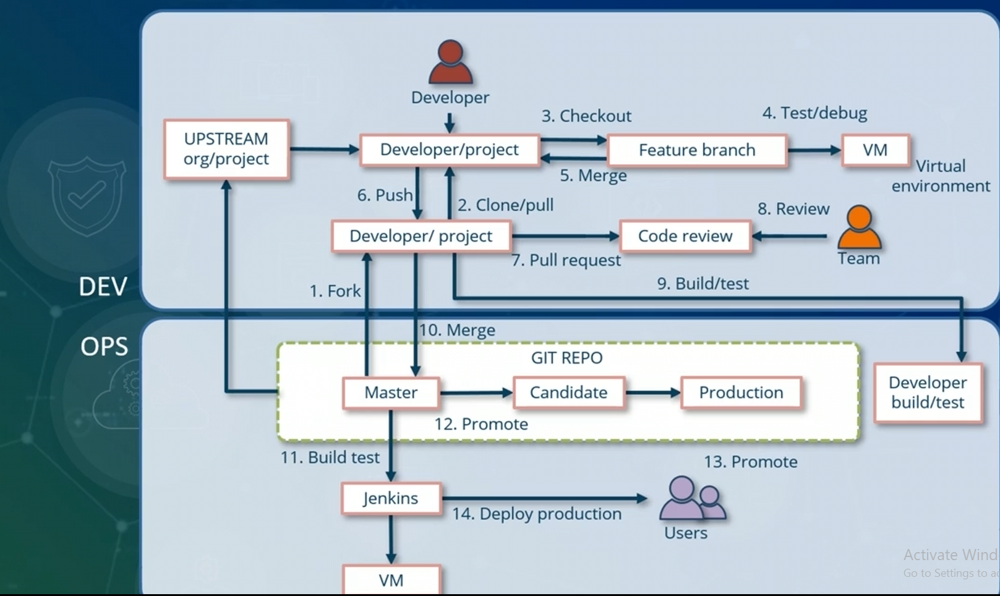

# Role of Git in Devops

- Provides a way to start on the DevOps path
- Enables developer collaboration
- Provides version control system
- Centralizes development assets

- GitHub
- Bitbucket
- GibLab
- Github Desktop

## Git Tool

- Github Desktop
- SourceTree
- TortoiseGit
- SmartGit
- Tower

# Git Terminologies

## Repositories

### Bare repository

### Local repository

### Remote repository

### Upstream repository

### Essential terms

#### Workspace

#### Working tree

#### Cache

#### Index

### Stash

#### Tracked files

#### Untracked files

#### Ignored files

### Github username/repository

### Origin

# Git commands for Repository Management

# Using Git GUI

# Repository Management

# Git Server and Protocols

# Distributed Git Workflows

# Branching

# Managing Branch Using Git Commands

# Exercise: Git for DevOps

# Take Test
